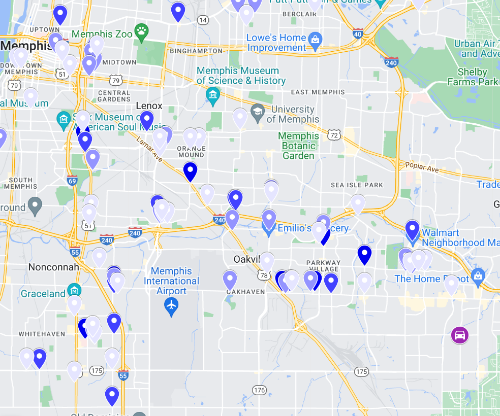

# Memphis Hot Spots

I created this example to show how hot spots of crime in Memphis are not where Nichols was pulled over. Partly in response [to this WSJ article](https://www.wsj.com/articles/tyre-nichols-case-prompts-questions-about-police-tactics-in-crime-hot-spots-11675311579) that suggests what Memphis was doing was hot spots policing.

Google map [illustrating result](https://www.google.com/maps/d/u/0/edit?mid=1Mcnjahet_yeE4z7_L-R_xfZBc-KH1co&usp=sharing)

Blog post on the write up, [Scorpion was probably not doing hot spots policing](https://andrewpwheeler.com/2023/02/13/scorpion-was-probably-not-doing-hot-spots-policing/).