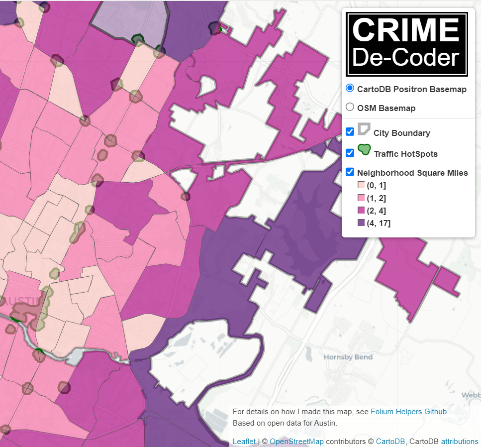

# Folium Helpers

Some example functions to manipulate folium maps. To create an environment to be able to run something like

    conda create --name=geo_env python==3.9 pip
    pip install geopandas folium matplotlib scikit-learn

Should work to create an environment. High level what this does:

 - creates a nice SVG legend for polygons and hotspots
 - shows to make a choropleth with arbitrary colors and legend
 - Uses javascript to insert additional notes and a legend title

To see this map in action, [check out this link](https://apwheele.github.io/MathPosts/Austin_Map.html).

If you want me to build something like this for your company, [get in touch](https://crimede-coder.com/contact)!

