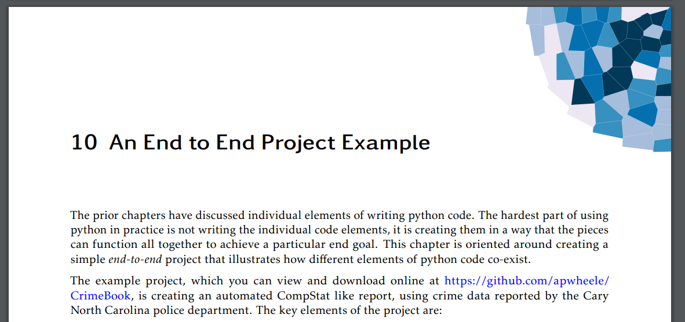

# Notes on Creating your own book

These are the my quarto config files I used to create [*Data Science for Crime Analysis with Python*](https://crimede-coder.com/blogposts/2023/EarlyReleasePython).

Part of these are how I do the Epub and LaTeX pdf separately, but are still somewhat cohesive with each other.

## Cache

To get an minimal python environment to replicate, use something like:

    requests
    pandas
    tabulate
    matplotlib
    notebook==6.4.12
    nbconvert[webpdf]
    jupyter_contrib_nbextensions
    jupyter-cache

Note the cache in the quarto config yaml! (Although you cannot use cache if you have inline code snippets, at least for python).

For long projects, cacheing is necessary to speed up iterations to see how things look (although compiling Latex is still redone from scratch every time and takes forever, Epub is fast though).

## Chapter Glpyhs

To get chapter glyphs I use this:

    \begin{tikzpicture}[overlay, remember picture]
    \node[xshift=-1.5in,yshift=-1.5in] at (current page.north east) {\includegraphics{chap_images/C01_latex.png}};
    \end{tikzpicture}
    
    ::: {.content-visible unless-format="pdf"}
    ```{=html}
    <style>
        #content {
            position: relative;
        }
        #content img {
            position: absolute;
            top: -85px;
            right: 0px;
            z-index: -1;
        }
    </style>
    
    <div id="content">
        
    </div>
    ```
    :::

This renders nicely in both the Epub and the PDF version. Epub


And the PDF version



It is not worth it for the epub, but for future print books I may try to figure out nicer glyphs to repeat on *every page* for the PDF version. When looking at the printed book it is nice to see the chapter locations (similar to how old school dictionaries have little indents to see the letters).

## Copyright

You can place a multi-line string in the Epub for the frontmatter for the ISBN, and can include images (or SVG directly).

For LaTeX you want to include a `copyright.tex` file in the yaml config. This you can include images/hyperlinks as well.

## Formatting Callouts

I do not like the way call-outs are default styled, so I do this for all call-outs in the book.

    ::: {.callout-note icon=false}
    Here are a few additional command line commands I use on a regular basis:
    
     - On Windows, to clear the terminal you can use `cls`, on Unix/MAC you can use `clear`
     - you can use `cat file.py` to print out the contents of a file to the terminal
     - you can use `mkdir` to make a new folder
     - you can pipe output to a file, e.g. `python hello.py > log.txt` would save the output of the command above to the `log.txt` file instead of printing to the terminal.
     - if you use `python script.py >> log.txt` this *appends* the output to log text file. Which is useful for repeated tasks that update over time.
    :::

And this seems to be acceptable in both Epub and PDF.

## Styling

So for the Epub, you need to use CSS to style. For the PDF, you need to putz with LaTeX. You can see some of my iterations in CSS, but I really just have:

    body {
      font-family: Verdana, sans-serif;
    }
    
    code {
      font-family: "Lucida Console", monospace;
      background-color: #D3D3D3;
    }
    
    
    div > pre > code {
      font-family: "Lucida Console", monospace;
      background-color: #ADD8E6;
      width: 100%;
      margin-right: 0px;
      display: block
    }
    
    .sourceCode {
      font-family: "Lucida Console", monospace;
      background-color: #D3D3D3;
    }

To get something similar in LaTeX, check out the `macros.tex` file. It redefines the verbatim environment to make a nice blue background.

Now when writing the content, to get my grey code + blue output look. Inline in text, you then want to do (for non-executed code blocks):

    ```default
    code here
    ```

To get a grey code block. If you do

    code here

It is blue by default using this css.

Note that I do not have the same fonts for the Epub (Verdana for most stuff and Lucida Console for code), and the PDF (kpfonts for most stuff and FiraMono for code). I think fonts that look good in one look like garbage in the other!

For the PDF, for scientific publications with figures/tables, you should use `\raggedbottom`, which I have in the macros.tex file.


## Python tricks

I use on occasion a default cell before the chapter to init python in a way that I want, without echoing the results.

    ```{python}
    #| echo: false
    #| eval: true
    
    # no warnings in output
    # have this before any items in the chapter
    
    import warnings
    warnings.filterwarnings("ignore")
    ```

I did not use it in the end, but you can also do sneaky things like monkey-patch the `print` function this way, to get it to print in your book format how you want.

# Formatting Epub for Amazon

I do not think Amazon cares at all about my fonts -- changing CSS and embedding font files directly does not seem to matter.

Amazon also did not like my chapter glyphs, I had to take those out for Amazon.

For the PDF (for the print on demand), you need to watch your margins. I have this in the `packages.tex` file:

    \usepackage{geometry}
     \geometry{
     letterpaper,
    bottom=0.8in,
    top=0.8in,
    left=0.8in,
    right=0.8in,
    includefoot
     }

Without `includefoot`, Amazon would yell at me that I have text too close to the bleed. Also note that *inline* code blocks can sometimes bleed out. I just manually changed my text so this did not happen. And so if I originally had `some super long code text block`, I would convert it into

    ```default
    some super long code text block
    ```

Which is fine and probably good practice anyway.

Last, the automatic Epub generated by Quarto could not be auto-converted to Amazon's format. I had to open the epub in [Calibre Reader](https://calibre-ebook.com/download) (which is free).


I had to fix *all* of the errors before Amazon would accept my epub. Most are just putzing with the CSS, (which if you fix one chapter, you can copy-paste that to the other chapters). Some may be my fault, but many just seem like they are automated that way in the Quarto/Pandoc pipeline (so I would dig into it and submit fixes if I knew exactly where in the pipeline they occurred!)

Note that Kindle has a previewer you can download locally. This lets you see somewhat better error messages, but mostly is much quicker than submitting online Epub and waiting a few minutes for Amazon to say "it cannot convert due to errors".

# Merging Files Together

For the PDF output, you may wish to add in a cover page. Although for Amazon (or other on demand publishers, I have used [LuLu](https://www.lulu.com/)), they make you make a for print cover in PDF. You can use ghostscript to combine the cover page and the PDF. This retains the links in the TOC, whereas other tools often strip the links. Here is how I created my sample for the first few chapters using ghostscript.

    gswin64 -q -sDEVICE=pdfwrite -o DS_PythonCrimeAnalysis_EarlyRelease.pdf -dLastPage=39 CoverPage.pdf Data-Science-for-Crime-Analysis-with-Python.pdf 