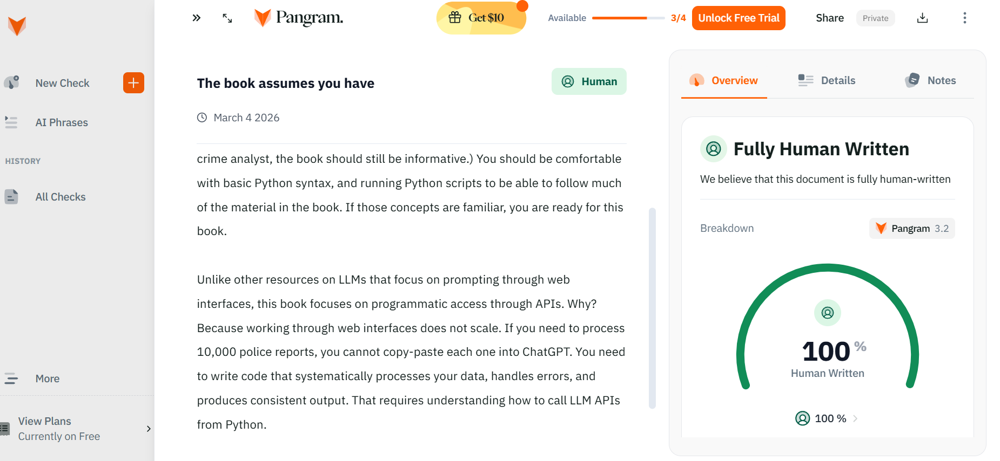
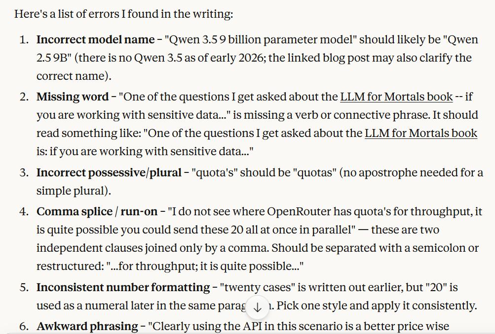

<!---
Using Claude Code to help me write
-->

This is not a post about Claude Code specifically. Copilot, Google's tools, or OpenAI alternatives could work similarly. The point is about how I use LLM tools to help with writing, and some notes on what works well versus poorly.

My recent book, [*LLMs for Mortals*](https://crimede-coder.com/blogposts/2026/LLMsForMortals), I used Sonnet 4.1 to write around 50% of the content. The total writing time compared to my prior book dropped from about a year to two months. That is a substantial productivity gain.

A reasonable question: does it read like it was written by a robot? I ran it through a few AI detection tools, and here is an example result from Pangram:

It does not flag as AI written. The detector tools are not great (many false positives for human writing), but this at least suggests the output is not obviously robotic.

The key insight is that LLMs are a tool. You can use a tool well or use it poorly. Here are my notes on using it well for writing.

## Copy Editing

One aspect that almost everyone will agree on is copy-editing. Even folks who are skeptical of LLM generated content will admit they are quite good at catching typos, awkward phrasing, and grammatical errors.

Here is an example from a recent [Crime De-Coder blog post on Local vs API models](https://crimede-coder.com/blogposts/2026/LocalvsAPI). I wrote the draft, then asked Claude to review it for copy-editing. You can see the [full conversation here](https://claude.ai/share/cef7040d-edd2-4ab7-ba10-8e9f670c5437).

It catches things I miss on my own read-throughs. This is the lowest risk use case -- you still read and approve every change, but it saves time compared to multiple manual passes.

## Writing New Content

For generating new content, the key is working in plain text markdown. Both my prior writing samples and the new content are just text files. This makes it easy to feed examples into the context window.

The workflow I settled on:

1. Have it review prior writing first. Point it at a folder of existing content and ask it to understand the style before generating anything new.
2. Write in small chunks. One chapter at a time, one section at a time. Do not ask it to generate an entire book or long document in one shot.
3. Iterate. The first draft is rarely right. Edit, re-prompt, refine.

For short form content like blog posts and social media, the output still tends toward marketing-speak. You need to actively push back against the cheerful corporate tone. I often tell it "less marketing fluff" or "more direct" in follow-up prompts.

Technical writing works better out of the box. Course notes, technical labs, documentation -- these have a more neutral expected tone, and the LLM does not try to sell you on the content. The [*LLMs for Mortals*](https://crimede-coder.com/blogposts/2026/LLMsForMortals) book is mostly technical explanation with code examples, which played to the tool's strengths.

## Extra about Citations

Citations are the weakest point. They do not work at all without manual verification. LLMs will confidently generate plausible-sounding but entirely fabricated references.

If you are using markdown and bibtex, one workaround is to provide a bibtex file of works that actually exist, and have the LLM only cite from that list using inline citation keys. This constrains it to real sources you have already vetted.

You should still manually review every citation. Check that the cited work actually says what the text claims it says. This is tedious but necessary.

In the future, I may build an MCP server that connects to [Semantic Scholar's API](https://api.semanticscholar.org) to verify citations exist before including them. For now, manual review is the only reliable approach.
